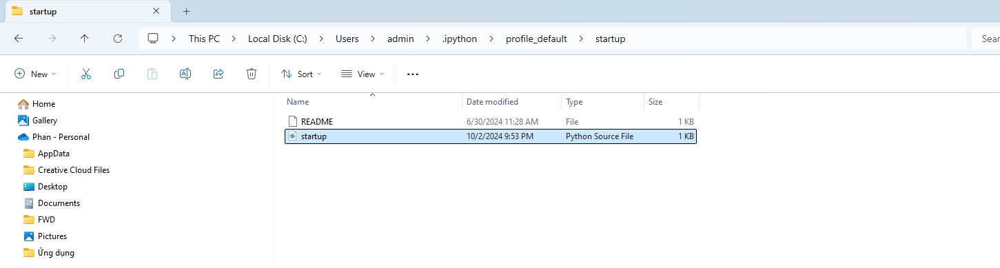
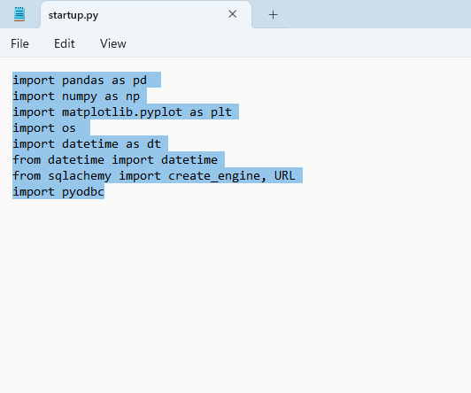
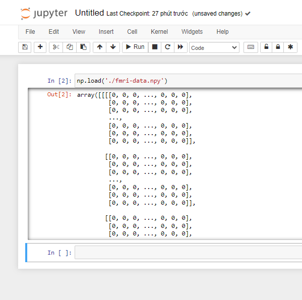

# Tự động import thư viện thường dùng trên Python.

Trong quá trình phân tích dữ liệu, bạn thường xuyên cần import các thư viện, đặc biệt là các thư viện cơ bản như pandas, numpy, matplotlib, os,... thao tác này thường lặp đi lặp lại và mất thời gian không cần thiết.
Hôm nay mình sẽ chỉ cho bạn 1 mẹo để tự động import các thư viện thường dùng vào note book mỗi khi khởi động.
Lưu ý: đây chỉ là một mẹo, không phải một giải pháp toàn diện, do đó nó có nhược điểm:
- Không hiển thị các thư viện đã được import, do đó bạn dễ quên các thư viện cần dùng tên gì.
- Chỉ config trên máy đang dùng, khi cần chuyển sang máy khác phải config lại.
- Import các thư viện không cần thiết, làm chậm trong quá trình chạy.

Nếu thấy bài viết hữu ích, hãy follow group của mình để nhận thông tin về bài viết mới.

[Hands on Data Analysis](https://www.facebook.com/profile.php?id=61556599619491) 

## Làm thế nào để tự động import các thư viện?

Để thực hiện việc import thư viện tự động trên Jupyter Notebook, bạn sẽ cần config trên Ipython.

Bước 1: tìm đến đường dẫn ~/.ipython/profile_default.

Cụ thể trên máy mình là: C:\Users\admin\.ipython\profile_default  (đa số máy tính đều sẽ giống như đường dẫn này nếu bạn cài đặt ở mặc định)

Bước 2: tạo file startup.py
Trong file startup, bạn import các thư viện muốn mặc định tự thêm khi khởi chạy notebook.
ví dụ:
import pandas as pd 
import numpy as np
import matplotlib.pyplot as plt
import os 
import datetime as dt
from datetime import datetime
from sqlachemy import create_engine, URL
import pyodbc

Bước 3: 
Lưu file startup.py và khởi động notebook.
Lúc này notebook vẫn trống nhưng nếu bạn thử gõ pd.read_csv() => bạn sẽ thấy notebook suggest các option cho bạn.

Chúc bạn thành công!
